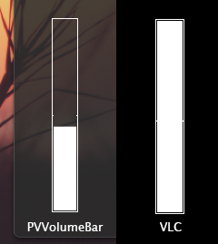
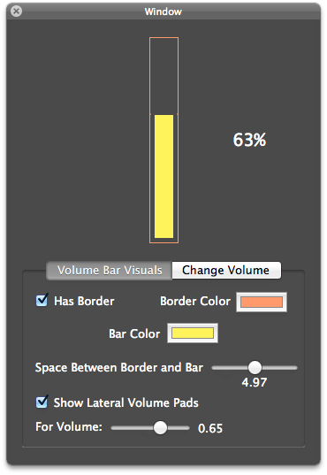

PVVolumeBar
===========

PVVolumeBar is a simple `NSView` subclass that emulates the Volume Bar you'd normally see on [VLC](http://www.videolan.org/vlc/) when it's in full screen mode.<br>
Here's the comparison between the VLC's volume bar and what you can do with `PVVolumeBar`



## Requirements

`PVVolumeBar` uses ARC and requires OS X 10.7+.

## Installation

1.  Add both .h and .m files of `PVVolumeBar` to your project.
2.  Import `PVVolumeBar.h` to wherever you want to use it just by `#import "PVVolumeBar.h"`
3.  Set the `PVVolumeBar` class to your `NSView` in Interface Builder or by code
4.  You're ready to kickass!


## How-to-use

### Customization of the Volume Bar
``` objective-c
[_volumeBar setHasBorder:YES]; //Show the border
[_volumeBar setHasBorder:NO]; //Hide the border

//Change the border color to any color you want
[_volumeBar setBorderColor:[NSColor cyanColor]];

//Change the border width
[_volumeBar setBorderWidth:5.0];

//Change the volume bar color to any color you want
[_volumeBar setBarColor:[NSColor redColor]];

//Change the space between the volume bar and the border
[_volumeBar setSpaceBetweenBorderAndBar:10.0];
```

#### PVVolumeBar Lateral Volume Pads

If you look closely to the VLC volume bar, you can notice that there are 2 small squares, in each side of the volume bar, in the 100% volume level. In `PVVolumeBar`, that's called `Lateral Volume Pads`. Here's an example image of that:


You can easily display the volume pads using the following code:
``` objective-c
//First you need to say to your PVVolumeBar that you want to show the Lateral Volume Pads
[_volumeBar setShowsLateralVolumePads:YES];

//And then, you need to say the volume you want to use so that the Lateral Volume Pads are displayed there
//For example, if your minimum volume is 0.0, maximum volume is 1.0 and you set 0.5 as the volume for Lateral Volume Pads
//the Lateral Volume Pads will be displayed right in the center of the Volume Bar
[_volumeBar setVolumeForLateralVolumePads:0.5];
```

### Changing the current volume

There are several ways of changing the current volume:
``` objective-c
//Change the current volume right away
[_volumeBar setCurrentVolume:1.0];

//Change the current volume using a smooth animation
[_volumeBar setCurrentVolume:1.0 animated:YES];

//Increase or decrease the current volume
[_volumeBar increaseCurrentVolumeBy:0.1 animated:YES];
[_volumeBar decreaseCurrentVolumeBy:0.1];
```

## Demo Project

This includes a Demo project that you can use to play around with `PVVolumeBar` and see how it feels and works.



## Apps using PVVolumeBar

If you're developing an app using PVVolumeBar, tell me something and I'll put a link here.

## Author - Contact

PVVolumeBar was created by Pedro Vieira.<br>
[pedrovieira.me](http://pedrovieira.me/)<br>
[@w1tch_](https://twitter.com/w1tch_)<br>
<a href="mailto:pedrovieiradev@hotmail.com?Subject=PVVolumeBar">pedrovieiradev@hotmail.com</a>

## License

Check "LICENSE" to know more (MIT).

